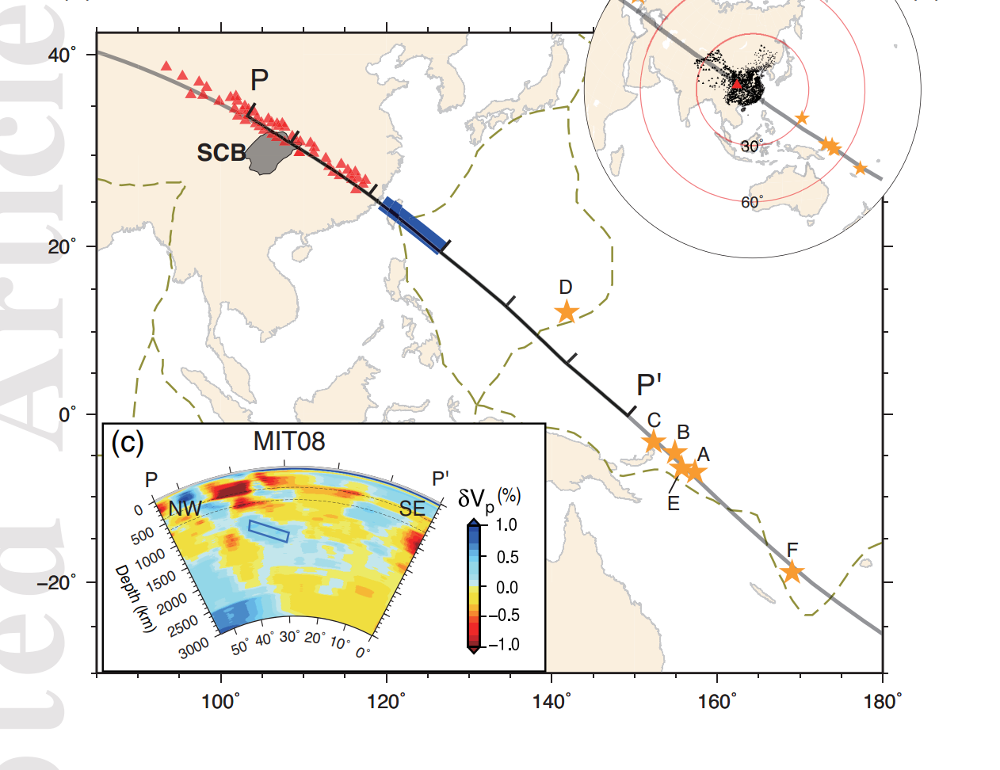
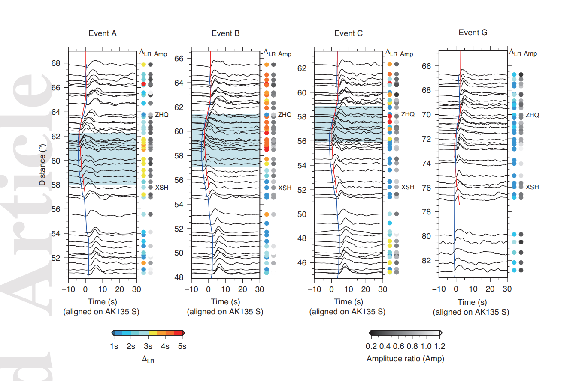

# paper1
___
_A lower mantle slab below the East Asia margin constrained by seismic waveform complexity_
_Yu Jing and Sun Daoyuan., 2022, JGR: solid earth_
___

### Key points
* __Strong multipathed waveforms__ are observed at stations near Sichuan Basin for events __coming from the southeast__.

* waveform complexity --- mutlipath dectetor method(MPD)

### motivation
Although the locations of events A-C are very close (Fig. 1), their multipathing patterns are different. Event A has strong waveform distortions at the distance range of 58-62 degree with of 3.5s, while event B shows the largest up to 5s at the distance range of 57-61 degree (Fig. 3). For those stations displaying strong multipathing for events A and B, the further northwest event C has a relatively simple waveform, while strong multipathing appears at stations located further northwest. The migration of MPD patterns among these events is difficult to explain by a shallow structure beneath the source or receiver. If the fast anomaly is located at the shallow mantle beneath the stations, all three events should have similar MPD patterns. In contrast, a shallow anomaly at the source side is also difficult to sample for all three events.

### Notes
* When seismic waves sample a sharp edge of an anomaly such as a slab, they generate multipathing with distorted wavefroms. (for a deep mantle slab, when rays are aligned with its edge, the multipathing effects occurs and produces distorted waveforms and amplitude variations)

* Due to the smoothing and damping applied in the inversion, tomographic imagines could underestimated amplitude and smearing morphology of anomaly bodies(such as the morphology of slab). 

* Waveform analysis and modeling provide complementary constraints on the geometry and physcial properties of the lower mantle slab, especially shapness, thickness, dipping direction, and lateral extent. 

*****************
_details of the multipath dectetot method (MPD), can referece:_

  * [Daoyuan Sun, Don Helmberger, Upper-mantle structures beneath USArray derived from waveform complexity, Geophysical Journal International,](https://doi.org/10.1111/j.1365-246X.2010.04847.x)

  * [Sun, D., Gurnis, M., Saleeby, J., and Helmberger, D. (2017), A dipping, thick segment of the Farallon Slab beneath central U.S., J. Geophys. Res. Solid Earth](https://doi.org/10.1002/2016JB01391)
